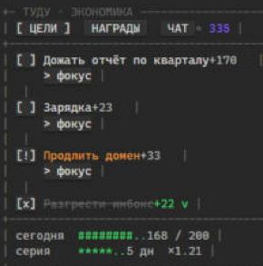
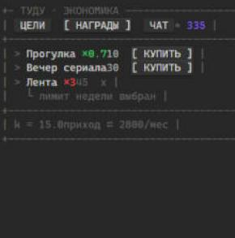

# ТУДУ · экономика баллов — плагин Obsidian

Тудушник, где выполненные задачи приносят баллы, а баллы тратятся на награды.
Приоритетное приносит больше, вредное стоит дороже. Интерфейс — ASCII, прямо
в боковой панели Obsidian, без единого лишнего файла в хранилище.

Главное отличие от обычных «геймификаций»: цены не выдуманы. Сначала система
измеряет, сколько баллов ты реально способен заработать за месяц, и уже из этого
**решает** стоимость наград — так, чтобы приход сходился с тратами. Поэтому вечер
сериала честно стоит примерно столько же, сколько времени ты потратишь, чтобы его
заслужить.

<table>
<tr>
<td align="center" width="50%">
<br>
<sub>цели — закрыл задачу, получил баллы, дневной потолок и серия видны сразу</sub>
</td>
<td align="center" width="50%">
<br>
<sub>награды — цены решены из бюджета, а не придуманы; вредное заперто лимитом</sub>
</td>
</tr>
</table>

Это настоящие скриншоты панели, не макет. Живёт прямо в правой шторке рядом с
заметками — открыл Obsidian, увидел баланс.

Что в этом хорошего, если коротко:

- **Цены решены, а не придуманы.** Плагин считает твой реальный месячный приход
  баллов и уже из него выводит стоимость наград — вечер сериала стоит ровно
  столько, сколько ты его заслуживаешь, не больше и не меньше.
- **Один файл — и никакой возни с синком.** Задачи, баланс, награды, серия и
  история живут в одном markdown-файле хранилища. Синкаешь его чем угодно —
  Obsidian Sync, iCloud, git — и на телефоне видишь ровно то же, что на компьютере.
- **Заводишь дела фразой в чат,** а не формой с десятью полями: «завтра дожать
  отчёт, часа полтора, тяжело идёт» — и задача уже в файле, с оценкой и
  приоритетом.
- **Сутки начинаются в 2 ночи, а не в полночь** — работал допоздна и отметил
  задачу в час ночи? Это ещё вчерашний день, серия не оборвётся зря.
- **Вредное не запрещено — оно честно дорогое,** с недельным лимитом на руках,
  а не силой воли.

---

## Что плагин кладёт в хранилище

Один markdown-файл. Больше ничего.

```
ТУДУ.md                              задачи — обычные галочки, а в конце —
                                      баланс, награды, экономика, серия, история
.obsidian/plugins/todo-economy/      то же самое как резервная копия, плюс чат
```

Задачи — не заметки. Заметка на задачу превращает хранилище в свалку из сотен
файлов по три строки, поэтому здесь их нет: задачи живут строками в одном
файле, обычным markdown-синтаксисом, который Obsidian рисует настоящими
галочками и в режиме чтения, и в режиме правки.

```markdown
- [ ] Дожать отчёт по кварталу `te 90m d1.2 p1.3 due2026-08-08 ~k3f9x2`
- [ ] Зарядка `te 20m d0.8 p1.2 rep1d ~q4x8mm`
- [x] Разгрести инбокс `te 25m d0.7 p0.9 done2026-08-06 ~a71bqz`
```

Плашка в конце строки хранит оценку в минутах, сложность, приоритет, повтор,
срок и идентификатор. Её можно править руками, а можно не трогать. Написал
голую галочку без плашки — плагин усыновит её со значениями по умолчанию и
допишет плашку сам.

Всё, что в файле не является строкой задачи, не трогается вообще: заголовки,
абзацы, ссылки, чужие списки, блоки кода. Плагин переписывает ровно те строки,
которые изменились.

**Баланс, награды и статистика тоже живут в этом файле** — служебным блоком
кода в самом конце:

~~~markdown
```te-state
{
  "balance": 168,
  "streak": { "days": 5, "lastDone": "2026-08-09" },
  "rewards": [ … ],
  …
}
```
~~~

Блок читается плагином и в остальном молчит: в списке задач его не видно, руками
трогать незачем. Держать его именно здесь, а не только в `data.json` плагина, —
осознанный выбор: многие синкают из хранилища только заметки, а служебные папки
плагинов — нет (git, Syncthing по выборочным путям, частичный iCloud). Если
синкается ровно этот файл, на другом устройстве подхватятся и закрытые задачи,
и баланс, и серия, и награды. `data.json` остаётся резервной копией на случай,
если файл вдруг потерялся, и источником при переходе со старой версии плагина,
где всё лежало только в нём.

**Синхронизация появляется бесплатно.** Файл лежит в хранилище, значит его
разносит по устройствам то, чем ты синхронизируешь Obsidian — Sync, iCloud,
git. Это то, чего не умела веб-версия: там данные жили в localStorage браузера,
и на телефоне был свой баланс, а на компьютере свой.

Сутки для экономики начинаются в 2 часа ночи, а не в полночь: закрыл задачу в
час ночи — это ещё вчерашний день, серия и дневной потолок не переезжают на
новые сутки раньше, чем ты лёг спать.

---

## Установка

Плагина нет в каталоге сообщества. Два способа:

**Через BRAT.** Установи плагин BRAT, `Add beta plugin`, вставь
`solidens/obsidian-todo-economy`. Обновления будут прилетать сами.

**Руками.** Скачай `main.js`, `manifest.json` и `styles.css` из
[релиза](https://github.com/solidens/obsidian-todo-economy/releases/latest),
положи в `<хранилище>/.obsidian/plugins/todo-economy/`, включи в настройках.

Дальше открой панель — иконка мишени на боковой панели или команда
`Todo Economy: открыть панель`. Чат попросит ключ OpenRouter. Ключ бесплатный и
без карты: [openrouter.ai/settings/keys](https://openrouter.ai/settings/keys)
→ Create key → скопировать → вставить.

---

## Как этим пользоваться

**Онбординг.** Чат спрашивает про твой рабочий день, задачи и то, чем ты себя
награждаешь. Отвечай как есть, обычными словами — он сам разберёт, что насколько
сложное и приоритетное. Отдельно спросит про вредное: на что залипаешь и потом
жалеешь. Отвечать честно выгодно — система не запрещает вредное, она делает его
цену честной. В конце покажет решённые цены и спросит, годятся ли.

Любой шаг можно пропустить словом «пропустить», а весь онбординг — пройти
заново из настроек.

**Экран целей.** Задачи с ценой в баллах. Помодоро 25/5 привязывается к
конкретной задаче кнопкой «фокус». Галочка закрывает задачу и начисляет баллы.
Передумал — сними галочку, начисление откатится ровно на ту же сумму, даже если
серия и потолок с тех пор изменились.

**Повторяющиеся задачи.** `rep1d` — каждый день, `rep2d` — через день,
`rep1w` — раз в неделю. Можно написать в чат: «зарядка двадцать минут каждый
день» — заведётся с повтором.

Закрытая повторяющаяся задача **не** отскакивает обратно сразу: она остаётся
закрытой до конца суток, чтобы было видно, что сегодня сделано, и всплывает
заново на смене дня. Отсчёт идёт от дня выполнения, а не от прежнего срока:
пропустил неделю — следующая через день после того, как вернулся, а не семь
просроченных разом. По той же причине повторяющиеся не штрафуются за
просрочку: у привычки пропуск — это просто пропуск.

**Экран наград.** Активны только те, что можно купить прямо сейчас. Три условия:
закрыта хотя бы одна задача сегодня, хватает баллов, не выбран недельный лимит
для вредного. Заблокированная строка пишет причину.

Восстановительные награды — сон, прогулка, отдых — не блокируются требованием
закрыть задачу. В плохой день человек не закрывает задачи именно потому, что
вымотан, и система, которая в этот момент запрещает отдохнуть, добивает вместо
того, чтобы вытаскивать. Если хочешь строже — переключатель в настройках.

**Если оценка кажется несправедливой** — скажи об этом в чат. Несправедливость
бывает двух сортов, и чат их различает.

Несправедлива оценка одной задачи: «отчёт вовсе не на полтора часа, а на три»,
«зарядка идёт тяжелее, чем записано» — правится строка, экономику это не
трогает.

Несправедлива вся система: «награды недостижимы», «слишком легко покупается».
Здесь первый ответ — не подкрутить цены, а **пересчитать месячный приход по
фактическим начислениям и заново решить `k`**. Обычно несправедлива не цена, а
исходная оценка: в онбординге человек описывает идеальную неделю, а живёт
обычную. Достаточно недели закрытых задач, дальше можно сказать «пересчитай по
факту» — и чат покажет, насколько онбординг соврал.

Пока данных мало, работает ручная поправка: «сделай дешевле» или «сделай
дороже» двигают цены шагами по 15 % в пределах от ×0.5 до ×2. Она хранится
отдельно от `k`, показывается на экране наград и снимается первым же
пересчётом по факту — чтобы всегда было видно, когда цены решены, а когда
подкручены.

**Чат** остаётся доступным всегда. Пишешь «завтра дожать отчёт, часа полтора,
идёт тяжело, важное» — заводится задача с разобранными минутами, сложностью и
приоритетом, и появляется строкой в файле. Так же и награды.

---

## Как устроена экономика

```
Начисление   P = clamp(мин, 10, 120) · clamp(сложность · приоритет, 0.6, 2.8)
Цена         price = round5( k · ценность · вред )
Замыкание    k = 0.85 · месячный_приход · 0.75 / Σ( частота · ценность · вред )
```

Третья строка — суть. Единственный свободный коэффициент `k` подбирается так,
чтобы желаемое потребление наград ровно исчерпало бюджет.

Вредное дороже через множитель до ×3 **и** ограничено жёстким лимитом частоты.
Одной цены мало: накопленный баланс может оплатить неделю саморазрушения. Цена
сдерживает частоту в среднем, лимит — в моменте. Восстановительное наоборот со
скидкой ×0.7.

Плюс защита от разбалансировки: излишек выше порога тает на 5 % в день, серии
дают до ×1.3, есть дневной потолок начислений и штрафы за просроченные важные
задачи.

---

## Что стоит знать заранее

**Ключ живёт на устройстве, а не в хранилище.** Он лежит в локальном хранилище
Obsidian, а не в `data.json` плагина — иначе уехал бы в Obsidian Sync и в git
вместе со всем остальным. Обратная сторона: на втором устройстве ключ придётся
ввести заново. Это ровно то же поведение, что было в вебе.

**Чат бесплатный, но не безлимитный.** Бесплатные модели OpenRouter дают
несколько десятков запросов в сутки на ключ. Онбординг съедает штук пять,
обычное добавление задачи — один. Упрёшься в потолок — отпустит на следующий
день; пополнение счёта OpenRouter на пару долларов поднимает суточную квоту
насовсем.

**Бесплатные модели слабее платных.** Иногда путают сложность с длительностью
или ломают формат ответа. Плагин это переживает: невалидный разбор просто не
применяется, а задачи всегда можно завести галочкой прямо в файле.

**Шрифт может быть любым, в том числе не моноширинным.** Выравнивание держится
на разметке, а не на подсчёте символов, поэтому годится и дуоспейсный шрифт:
в iA Writer Duo буквы `m`, `M`, `w`, `W` в полтора раза шире прочих, и панель
всё равно рисуется ровно. iA Writer Mono, разумеется, тоже. Шрифт панели
задаётся отдельно от шрифта заметок — в настройках плагина; пусто означает
«брать моноширинный из настроек Obsidian».

Псевдографику плагин обмеряет сам. Если в шрифте нет `─ │ █ ░`, они
подставляются из чужого семейства и разъезжаются по ширине и высоте — тогда
панель молча переходит на набор из чистого ASCII. Видишь пустые квадраты —
переключи вручную там же в настройках. Лигатуры отключены принудительно:
иначе `--` склеивается в один глиф.

**Работает на телефоне.** Запросы идут через `requestUrl`, который есть и на
мобильном. На узкой панели раскладка сама схлопывается: пропадает строка со
сложностью, укорачиваются полоски.

---

## Для тех, кто полезет в код

```bash
npm install
npm test      # 149 проверок ядра, без сети и без Obsidian
npm run build # tsc + esbuild → main.js
npm run dev   # сборка в режиме наблюдения
```

Технические заметки — в [`NOTES.md`](NOTES.md).

## Лицензия

MIT.
